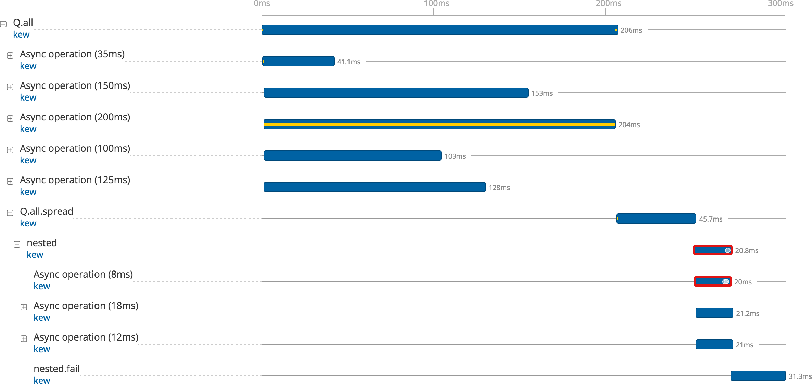

# traced-kew

A promise library compatible with [Medium's kew promises library](https://github.com/Medium/kew) with support added for LightStep OpenTracing instrumentation.

*Compatibility-note: the library implementation currently relies on several LightStep-specific methods and is not compatible with all OpenTracing tracer implementations.*

* [Getting started](#getting-started)
* [Demo](#demo)
* [API](#api)

## Getting started

```bash
npm install --save traced-kew
```

Initialize the OpenTracing global tracer (*the library currently uses the OpenTracing global tracer for all operations*):

```javascript
Tracer.initGlobalTracer(LightStep.tracer({
    access_token   : '{your_access_token}',
    component_name : 'kew-example',
}));
```

Use the library as you would use the kew library:

```javascript
import Q from 'traced-kew';

Q.all([
  Q.delay(50),
  Q.delay(20),
]).then(() => {
  console.log('Done!');
});
```

Use the `traced` version of the various `kew` methods to add OpenTracing tracing annotations:

```javascript
import Q from 'traced-kew';

// Start a span to track the chained promises
let span = Tracer.startSpan('Q.all');
Q.tracedAll(span, [
  Q.tracedDelay('a delay of 50ms', span, 50),
  Q.tracedDelay('a delay of 20ms', span, 20),
]).tracedThen((span) => {
  span.logEvent('The promises have resolved!');
  console.log('Done!');
})
.finish(); // Let the library know the chaining is done
```

:success_parrot:

## Demo

The `access_token` values in the examples need to be updated to your project's access token, then the following can be run:

```
make demo-ok    # Makes a trace with only successful operations
make demo-fail  # Makes a trace containing spans with errors
```

#### Trace for the resolved promises


#### Trace for the rejected promises




## API

* **Static methods**
  * `all(promises)`, `tracedAll(span, promises)`
  * `bindPromise(fn, scope, …boundArgs)`
  * `defer()`, `tracedDefer(name, parentSpan)`
  * `delay(ms)`, `tracedDelay(name, parent, ms)`
  * *fcall is not yet implemented*
  * *isPromise is not yet implemented*
  * *isPromiseLike is not yet implemented*
  * *ncall is not yet implemented*
  * *nfcall is not yet implemented*
  * `reject(reason)`
  * `resolve(value)`
  * `spread(promise, fn)`
  * `stats()`
  * `allSettled(promises)`
  * `getNextTickFunction()`
  * `setNextTickFunction()`
* **Instance methods**
  * `fail(function(reason))`, `tracedFail(function(span, reason))`
  * `fin(function)`, `tracedFin(function(span))`
  * `makeNodeResolver()`
  * `spread(…args)`, `tracedSpread(span, …args)`
  * `reject(reason)`
  * `resolve(value)`
  * `then(function(result))`, `tracedThen(function(span, result))`
  * `finish(function(span))`
  * `span()`


## Testing

```
make test
```

